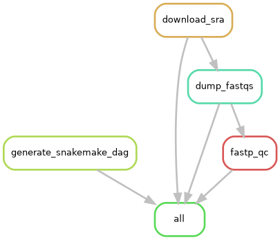

# Snakemake genome assembly practice

Practicing using Snakemake to:
* Download unassembled genomes from SRA using [SRA toolkit](https://github.com/ncbi/sra-tools/wiki)
* Quality control with [FASTP](https://github.com/OpenGene/fastp)
* Assembled genomes with [SPAdes](https://github.com/ablab/spades#sec3.1)
* Get genome assembly metrics with [CheckM2](https://github.com/chklovski/CheckM2)

## Running the pipeline

* Edit the config file in the indicated places
* Have SRA toolkit and fastp installed. There will be conda environments/docker containers for these in the future, but for now, it is required that they are installed and accessible via PATH.
* Install `snakemake`. A bare conda/mamba environment is recommended (ie., created with `mamba craete -c conda-forge -c bioconda -n snakemake snakemake`)
* Run the pipeline with `snakemake --use-conda -c`

## Assumptions

* The fastq files dumped from SRA are paired-end (ie, after dumping, they'll be named something like `SRRXXXXX_pass_1.fastq.gz` and `SRRXXXXX_pass_2.fastq.gz`)

## Workflow

## To do

- [x] Assembly metrics (QUAST, checkm2)
- [ ] Enable conda/docker support for:
    - [ ] SRA toolkit
    - [ ] FASTP
    - [x] SPAdes
    - [x] QUAST
- [ ] Enable slurm support
- [x] Change fastp report outputs
    - [x] See https://github.com/OpenGene/fastp#simple-usage
