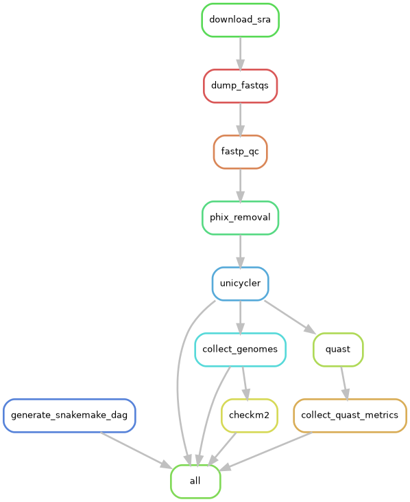

# Snakemake genome assembly practice

Practicing using Snakemake to:
* Download unassembled genomes from SRA using [SRA toolkit](https://github.com/ncbi/sra-tools/wiki)
* Quality control with [FASTP](https://github.com/OpenGene/fastp)
* phiX spikein removal with [bbduk](https://jgi.doe.gov/data-and-tools/software-tools/bbtools/bb-tools-user-guide/bbduk-guide/)
* Assembled genomes with [SPAdes](https://github.com/ablab/spades#sec3.1)
* Get genome assembly metrics with [CheckM2](https://github.com/chklovski/CheckM2)

## Running the pipeline

* Edit the config file in the indicated places
* Install `snakemake`. A bare conda/mamba environment is recommended (ie., created with `mamba create -c conda-forge -c bioconda -n snakemake snakemake`)
* Edit `config/config.yml`. 
    * `sra_list` should be the path to a newline-separated file of SRA accessions.
    * Enter the path to the checkm2 database on your system. If you don't have it installed, you can download it directly from [here](https://zenodo.org/api/files/fd3bc532-cd84-4907-b078-2e05a1e46803/checkm2_database.tar.gz) ([source](https://github.com/chklovski/CheckM2/issues/74)) and put enter the path into the config file.
    * By default, the pipeline will put everything into the `output` folder - change the path if you'd like it to be put somewhere else
* Edit `slurm/config.yaml`.
    * In particular, you'll need to edit the `default-resources` entry with the default partition you'd like to use to submit slurm jobs to.
* Run the pipeline with `snakemake --use-conda -c`

## Assumptions

* The fastq files dumped from SRA are paired-end (ie, after dumping, they'll be named something like `SRRXXXXX_pass_1.fastq.gz` and `SRRXXXXX_pass_2.fastq.gz`)

## Workflow

## To do

- [ ] Reports
    - [ ] Spades runtime reports
    - [ ] Metric plots
        - See here for parameterizing R scripts with Snakemake: https://snakemake.readthedocs.io/en/stable/snakefiles/rules.html#r-and-r-markdown
- [ ] Clean up names in checkm2 and quast metric outputs
- [ ] 
- [ ] Modify running time for CheckM2, overall workflow based on number of inputs
    - https://snakemake.readthedocs.io/en/stable/snakefiles/rules.html#resources
